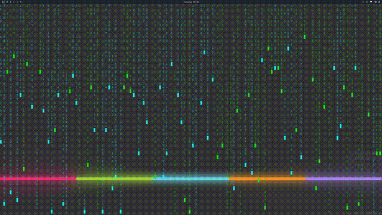

================================================================================

    +--------------------------------------------------------------+
    |                                                              |
    |   _  _  _  _  _  _  _  _  _  _  _  _  _  _  _  _  _  _     |
    |                                                              |
    |        100% VIBECODED AND UNREVIEWED BY HUMANS.          |
    |            HERE BE DRAGONS. YOU HAVE BEEN WARNED!                        |
    |   _  _  _  _  _  _  _  _  _  _  _  _  _  _  _  _  _  _     |
    |                                                              |
    +--------------------------------------------------------------+

================================================================================

MATRIX WALLPAPER
================

A live desktop wallpaper for Hyprland that visualizes real network traffic as
falling Matrix-style green streams. Each stream represents an actual packet
flowing through your network interface, rendered directly on the Wayland
background layer using wlr-layer-shell.

The background is fully transparent, so your existing wallpaper shows through
behind the streams. Plaintext packet metadata (protocol, IPs, ports) is
displayed as readable text. Encrypted traffic is shown as raw hex bytes.
Inbound traffic falls in green, outbound in cyan. The leading head of each
stream blinks as it descends. A small stats bar in the bottom-right shows
current throughput.

HOW IT WORKS
============

  - Captures live packets via libpcap on your default network interface
  - Formats packet metadata (protocol, IPs, ports) into character streams
  - Renders them as falling columns onto a full-screen wlr-layer-shell
    background surface using Cairo and Pango for text rendering

DEPENDENCIES
============

Build-time:
  - gcc (or any C11 compiler)
  - pkg-config
  - wayland-scanner
  - wayland-protocols (for xdg-shell XML)

Libraries:
  - libpcap        - packet capture
  - wayland-client  - Wayland display connection
  - cairo           - 2D rendering
  - pango / pangocairo - text layout and rendering
  - glib            - required by Pango

Runtime:
  - Hyprland (or any wlroots-based Wayland compositor with layer-shell support)
  - CAP_NET_RAW capability on the binary, or root access

On Arch Linux:
  pacman -S base-devel libpcap cairo pango glib2

On Fedora:
  dnf install gcc make pkg-config libpcap-devel cairo-devel \
      pango-devel glib2-devel

On Ubuntu / Debian:
  apt install build-essential libpcap-dev libcairo2-dev \
      libpango1.0-dev libglib2.0-dev

BUILD
=====

  cd matrix-packets
  make

The binary is output to the repo root as `matrix-wallpaper`.

To run without root:

  sudo setcap cap_net_raw=eip matrix-wallpaper

USAGE
=====

  ./matrix-wallpaper [interface]

If no interface is given, it auto-detects the most active one.

To install system-wide:

  cd matrix-packets
  sudo make install

CONFIGURATION
=============

All settings are compile-time constants. Edit the values and rebuild with
`make` to apply changes.

**Display** — `matrix-packets/render_wayland.c`

| Setting | Default | Description |
|---------|---------|-------------|
| `FONT_FAMILY` | `"monospace"` | Font face for stream characters |
| `FONT_SIZE` | `14` | Font size in points |

**Frame Rate** — `matrix-packets/matrix_packets.c`

| Setting | Default | Description |
|---------|---------|-------------|
| `FRAME_DELAY_US` | `100000` | Microseconds between frames (100000 = 10 FPS) |

**Streams** — `matrix-packets/streams.h`

| Setting | Default | Description |
|---------|---------|-------------|
| `MAX_STREAMS` | `512` | Maximum concurrent streams on screen |
| `MAX_STREAM_LENGTH` | `160` | Maximum characters per stream |
| `STREAM_SPEED_MIN` | `0.4` | Minimum fall speed (rows per frame) |
| `STREAM_SPEED_RANGE` | `1.5` | Random range added to min speed |
| `FADE_DELAY_MIN` | `30` | Minimum frames before a stream fades out |
| `FADE_DELAY_RANGE` | `120` | Random range added to fade delay |
| `FADE_RATE` | `2` | Characters removed per frame while fading |
| `BLINK_CYCLE` | `6` | Total frames in one blink cycle |
| `BLINK_ON` | `3` | Frames the head block is visible per cycle |
| `COLUMN_GAP` | `1` | Minimum empty columns between streams |
| `PACKETS_PER_FRAME` | `20` | Max packets consumed per frame |

**Capture** — `matrix-packets/capture.h`

| Setting | Default | Description |
|---------|---------|-------------|
| `MAX_PACKET_SIZE` | `1500` | Bytes captured per packet |
| `RING_BUFFER_SIZE` | `2048` | Packet queue capacity |
| `MIN_PACKET_DISPLAY` | `20` | Min payload bytes to display hex stream |
